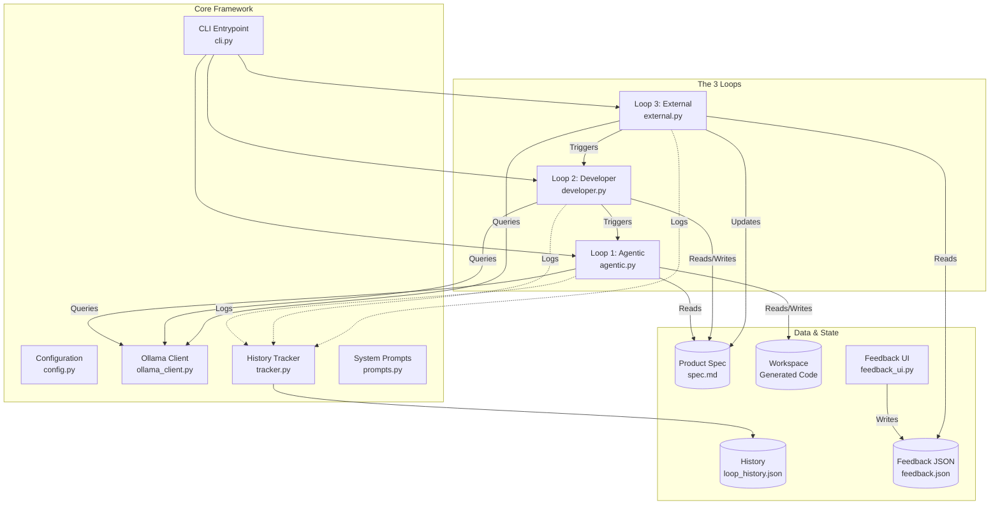

# Architecture Overview: Loop Engineering

This document outlines the architecture of the **Loop Engineering** project, which implements the 3 Key Product Development Loops as a concrete, runnable system powered by local LLMs (Ollama).

## 1. System Architecture

The project is structured around decoupled components that manage configuration, LLM interaction, feedback collection, and the nested execution of the three loops.

## 2. The Three Nested Loops

The system is designed with three distinct loops operating at different timescales and levels of granularity.

### Loop 1: Agentic Coding Loop (Minutes)
**Goal:** Generate code that passes tests.
- **Input:** Current `spec.md`
- **Process:** 
  1. The LLM reads the spec and generates files (`app.py`, `templates/`, `tests/`).
  2. The system executes `pytest`.
  3. If tests fail, the error output is fed back to the LLM for a fix.
  4. Repeats until tests pass or max iterations are reached.
- **Output:** A functional (or partially functional) codebase in `workspace/`.

### Loop 2: Developer Feedback Loop (Hours)
**Goal:** Refine the product spec based on human developer review.
- **Input:** The running application and the developer's human intuition.
- **Process:**
  1. Executes **Loop 1** to get a baseline application.
  2. Pauses to allow the developer to review the app.
  3. The developer inputs natural language feedback (e.g., "The button should be blue").
  4. The LLM synthesizes this feedback and updates `spec.md`.
  5. Repeats, triggering Loop 1 again with the new spec.
- **Output:** An updated `spec.md` and a refined application.

### Loop 3: External Feedback Loop (Days)
**Goal:** Align the product with external user/tester needs.
- **Input:** Feedback submitted by end-users via the Web UI.
- **Process:**
  1. Executes **Loop 2** (which executes Loop 1) to produce a testable product.
  2. Spins up a Flask Web UI (`feedback_ui.py`) on port `5001`.
  3. External testers use the UI to submit bug reports or feature requests.
  4. The developer signals when collection is done.
  5. The LLM summarizes all collected feedback and makes high-level updates to `spec.md`.
  6. Repeats, triggering Loop 2 again.
- **Output:** Major spec revisions driven by actual user data.

## 3. Execution Sequence

The following sequence diagram illustrates how `loop-eng full` cascades down through the loops and back up.

```mermaid
sequenceDiagram
    actor User as External Testers
    actor Dev as Developer
    participant L3 as External Loop
    participant UI as Feedback UI
    participant L2 as Developer Loop
    participant L1 as Agentic Loop
    participant LLM as Ollama Model
    participant WS as Workspace (Code)

    Dev->>L3: Run `loop-eng full`
    
    rect rgb(30, 41, 59)
        note right of L3: Loop 3: External Feedback (Days)
        L3->>L2: Trigger Developer Loop
        
        rect rgb(20, 83, 45)
            note right of L2: Loop 2: Developer Feedback (Hours)
            L2->>L1: Trigger Agentic Loop
            
            rect rgb(30, 58, 138)
                note right of L1: Loop 1: Agentic Coding (Minutes)
                loop Until Tests Pass or Max Iter
                    L1->>LLM: Provide Spec
                    LLM-->>L1: Generate Code Blocks
                    L1->>WS: Write Files
                    L1->>WS: Run `pytest`
                    WS-->>L1: Test Results
                    opt If Tests Fail
                        L1->>LLM: Provide Test Errors
                    end
                end
            end
            
            L1-->>L2: Agentic Loop Complete
            L2->>Dev: Prompt for Developer Feedback
            Dev-->>L2: Provide Feedback
            L2->>LLM: Rewrite Spec with Feedback
            LLM-->>L2: Updated Spec
        end
        
        L2-->>L3: Developer Loop Complete
        L3->>UI: Launch Feedback Web UI
        UI-->>User: Serve Portal on port 5001
        User->>UI: Submit Feedback
        Dev->>L3: Signal Feedback Collection Done
        L3->>UI: Stop Web UI
        L3->>LLM: Summarize Feedback & Update Spec
        LLM-->>L3: Updated Spec
    end
```

## 4. Component Details

### `ollama_client.py`
A lightweight wrapper around the Ollama REST API (`/api/chat`). We avoid heavyweight SDKs to ensure zero-dependency friction and direct control over the payloads. It supports temperature tuning and JSON structured output where necessary.

### `agentic.py` (The Extractor)
A critical challenge with smaller, local LLMs (like `gemma2:2b` or `qwen2.5-coder:0.5b`) is output formatting. They frequently fail to follow strict markdown block paths. `agentic.py` contains a robust extraction engine that uses 5 distinct strategies (path headers, language tags, HTML/Python comments, bold text, and inference mapping) to guarantee code gets written to the correct files.

### `feedback_ui.py`
A self-contained Flask application injected dynamically during Loop 3. It runs on an independent port (`5001`) to avoid colliding with the generated application running on port `5000`. It acts as a black box data sink, writing structured JSON to `feedback.json`.
