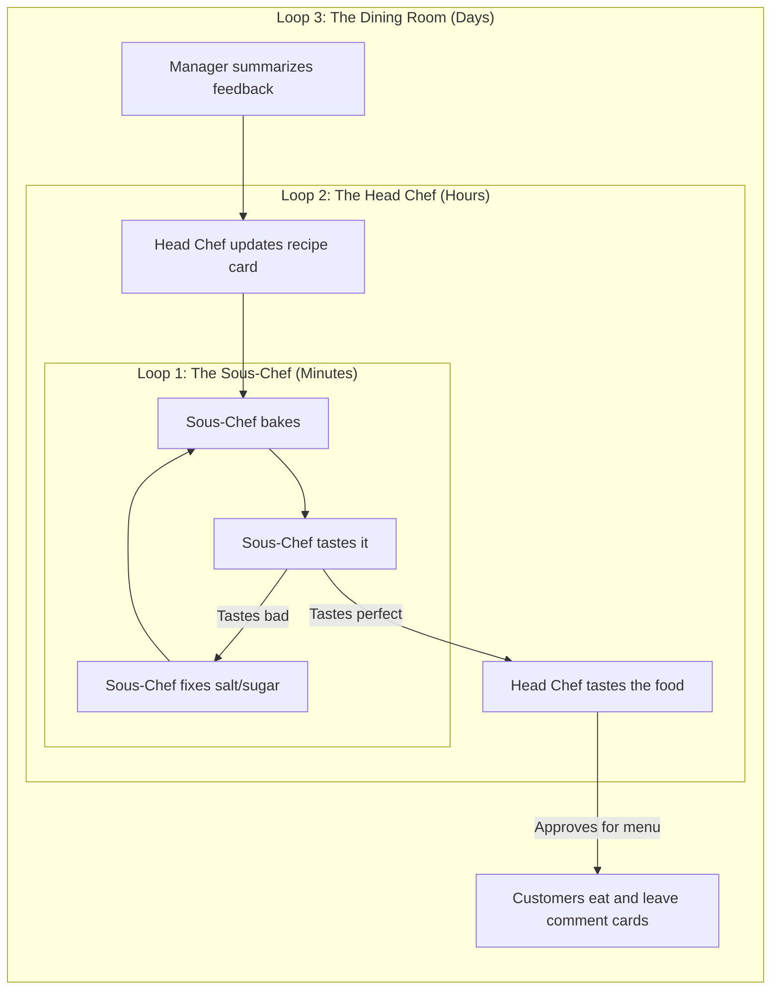

# A Layman's Guide to Loop Engineering

If you are not a software engineer, the concept of "AI Agentic Workflows" and "Nested Developer Loops" might sound like sci-fi jargon. 

To understand what this project actually does, let's step away from computers entirely and imagine we are opening a **restaurant**.

## The Problem with "One-Shot" AI

When most people use AI (like ChatGPT), they type a prompt: *"Write me a recipe for the perfect chocolate cake."* The AI thinks for a few seconds and spits out a recipe. 

If the cake tastes bad when you bake it, you have to go back and argue with the AI. This is called **Zero-Shot** or **One-Shot** generation. It relies on the AI getting it perfectly right on the first try. In software engineering, this almost *never* works for complex apps.

## The Solution: Loop Engineering

Instead of demanding perfection on the first try, **Loop Engineering** embraces failure. It sets up systems where the AI can fail, realize it failed, fix its mistakes, and ask for human guidance at the right moments.

This project implements **Three Nested Loops**. Let's explain them using our restaurant analogy.

---

### Loop 1: The Sous-Chef in the Kitchen (Timescale: Minutes)
*The Agentic Coding Loop*

Imagine you hire an AI as your Sous-Chef. You hand them a recipe card (the **Product Spec**) and say, *"Bake this chocolate cake."*

1. The AI mixes the batter and bakes the cake (writes code).
2. It takes a bite of the cake (runs automated tests).
3. The cake is too salty! (The tests fail).
4. The AI looks at the salt shaker, realizes its mistake, and bakes a *new* cake with less salt.
5. It repeats this until the cake tastes exactly like the recipe card says it should.

**In software:** The AI writes code, runs `pytest`, sees the error messages, and rewrites the code to fix the bugs without a human ever having to look at it.

---

### Loop 2: The Head Chef Tasting (Timescale: Hours)
*The Developer Feedback Loop*

The Sous-Chef (Loop 1) is great at following instructions, but they have no creative vision. Once the cake tastes exactly like the recipe card, they bring it to you—the **Head Chef** (the human developer).

1. You take a bite of the perfectly executed cake. 
2. You realize: *"Actually, this needs a raspberry drizzle on top."*
3. You take a pen and **update the recipe card** (the Spec) to include raspberry drizzle.
4. You hand the recipe card back to the Sous-Chef.

**In software:** The AI gives you a working, bug-free app. You play with it, realize you want a new feature or a design change, and tell the AI. The AI updates the underlying architecture documents and goes back to Loop 1 to build it.

---

### Loop 3: The Customers in the Dining Room (Timescale: Days)
*The External Feedback Loop*

Now the cake has a raspberry drizzle and the Head Chef loves it. It's time to put it on the menu and serve it to actual customers (external users).

1. Customers eat the cake.
2. They fill out comment cards: *"The cake is delicious, but the slice is too big!"* or *"I'm allergic to raspberries."*
3. The restaurant manager gathers 100 comment cards and brings them to the Head Chef.
4. The Head Chef realizes they need to change the vision of the dessert menu (maybe offer a mini-cake, or swap raspberry for strawberry). They update the master recipe book.
5. The Head Chef gives the new recipes to the Sous-Chef (Loop 1) to start baking.

**In software:** We launch a real website where actual users can test the app. They submit bug reports and feature requests. The AI reads all this real-world feedback, figures out how to translate it into technical requirements, and updates the core Spec so the Developer (Loop 2) and Agent (Loop 1) can build what people actually want.

---

## Summary Diagram

By nesting these loops, we ensure that:
1. The AI handles the tedious trial-and-error of syntax and bugs (Loop 1).
2. The Human Developer maintains creative control and architecture (Loop 2).
3. The Product actually solves real-world user needs (Loop 3).
