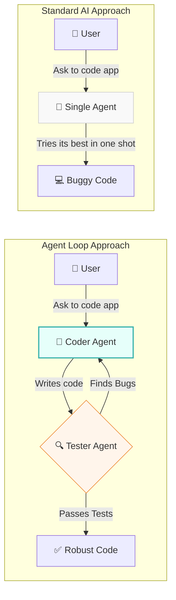
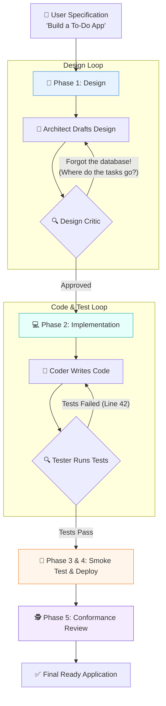

# 🏭 The Assembly Line: A Layman's Guide to Agent Loop Engineering

Imagine you are running a construction company. You wouldn't just hire a single handyman, give them a blank check, and say, "Build me a skyscraper," hoping they get it right on the first try. (Spoiler alert: they won't, and you will end up with a very expensive, leaning tower).

Instead, you'd hire a team of specialists:
1. An **Architect** to draw blueprints. 
2. A **Senior Engineer (Critic)** to review the blueprints and send them back for revisions if they are flawed. 
3. **Builders (Coders)** to actually pour the concrete and frame the walls.
4. **Quality Assurance (Testers)** to inspect the build. If a wall is crooked, it goes back to the builders to fix.

That is exactly what **Agent Loop Engineering** is. It is a framework that takes individual AI agents and organizes them into a highly structured "assembly line" (a loop) where they collaborate, critique, and fix each other's work to achieve a complex goal.

---

## 📖 Table of Contents

* [1. What is an AI "Loop"?](#1-what-is-an-ai-loop)
* [2. The Problem: Why Do We Need Loops?](#2-the-problem-why-do-we-need-loops)
* [3. The Core Architecture: Data-Driven Pipelines](#3-the-core-architecture-data-driven-pipelines)
* [4. A Full Real-World Example: Building a "To-Do List" App](#4-a-full-real-world-example-building-a-to-do-list-app)
* [5. Customizing Your Factory: No Coding Required!](#5-customizing-your-factory-no-coding-required)
* [6. Summary](#6-summary)

---

## 1. What is an AI "Loop"?

Most people are used to standard AI (like ChatGPT): you ask a question, and it answers. Even an "AI Agent" that uses tools (like a web browser or calculator) is usually working completely alone. (Which means when it inevitably goes off the rails, there is no adult in the room to stop it.)

An **AI Loop** is when multiple AI agents work together in a structured cycle. One agent writes something, another checks it, and if it's wrong, it goes back to the first agent to fix it.

---

## 2. The Problem: Why Do We Need Loops?

When you ask an AI to do something huge—like writing a complete software application from scratch—it often fails if it tries to do it in one single shot. 
* It might misunderstand the requirements.
* It might write code with bugs.
* It might create an architecture that doesn't make sense (like inventing a new programming language just to print 'Hello World').

By breaking the giant task into smaller, specialized phases, and putting **Critique Gates** between them, the AI can catch its own mistakes. 

> [!TIP]
> Think of it like a writer and an editor. The writer (the "Actor") creates the content, and the editor (the "Critic") reviews it. They loop back and forth until the draft is perfect (or until they run out of AI patience).

But building these multi-agent workflows from scratch in code is tedious and inflexible. Every time you want to add a new reviewer or change the order of operations, you have to rewrite the core software.

---

## 3. The Core Architecture: Data-Driven Pipelines

The **Agent Loop Engineering** framework solves this by making the entire process **data-driven**. This means you don't write Python code to connect agents. Instead, you write a simple configuration file.

### 📋 The Blueprint: `agents.yaml`

The framework is driven by a single text file called `agents.yaml`. It contains two main things:
1. **Agents:** A list of every worker in your factory and what their job is (e.g., "Architect," "Tester," "Deployer").
2. **Gates:** The rules for how they check each other's work (e.g., "The Design Critic must approve the Architect's work before moving forward. They get 3 tries to get it right.").

---

## 4. A Full Real-World Example: Building a "To-Do List" App

Let's see what happens when we ask the default software factory to build a simple "To-Do List" app.

### 📐 Phase 1: Design & Critique (The Drafting Room)
* **What happens:** The **Architect** reads your request and writes a technical design document (e.g., "We will use Python and save tasks in a file").
* **The Gate:** The **Design Critic** steps in. It reviews the design. If it spots a flaw—like "You forgot to include a way to mark tasks as completed, which defeats the entire purpose of a To-Do list!"—it sends the blueprint back to the Architect to fix. 

### 💻 Phase 2: Implementation & Testing (The Factory Floor)
* **What happens:** Once the blueprint is approved (and actually makes sense), the **Coder** writes the actual source code.
* **The Gate:** The **Tester** runs automated tests on the code. If the code crashes or fails, the exact error messages are sent back to the Coder. They loop back and forth until the code works perfectly.

### 🚀 Phase 3 & 4: Smoke Test & Deployment (Shipping It)
* **What happens:** A **Smoke Tester** runs a quick script to make sure the app actually turns on (and doesn't immediately crash your computer). Finally, the **Deployer** writes the Dockerfiles needed to run the app in the real world.

### 🕵️ Phase 5: Conformance Review (The Final Inspection)
* **What happens:** A **Conformance Agent** looks at the final, working product and compares it one last time to your original request. "Did it build a To-Do App? Yes. Is it secretly mining cryptocurrency? Hopefully not."

---

## 5. Customizing Your Factory: No Coding Required!

The true magic of this framework is that you are not locked into the "Software Factory" setup. Because it is a **Loop Engineering Laboratory**, you can invent completely new team structures just by editing the `agents.yaml` text file.

> [!NOTE]
> **Example 1:** Want to add a **Security Reviewer** that checks the Coder's work before the Tester gets it? Just add it to the file.
> 
> **Example 2:** Want to change the pipeline to write a novel (with a Writer, Editor, and Fact-Checker) instead of software? You can do that without touching the core Python code!

---

## 6. Summary

**Agent Loop Engineering** is about moving away from treating AI as a magic 8-ball that gives you a perfect final answer in one try. 

Instead, it treats AI as a **workforce**. By engineering smart loops, reviews, and gates, you can use AI to build complex, reliable systems that catch their own mistakes before they ever reach you. 

It's not just an AI taking actions; it's a fully automated assembly line (and unlike humans, they don't complain about working on weekends).
